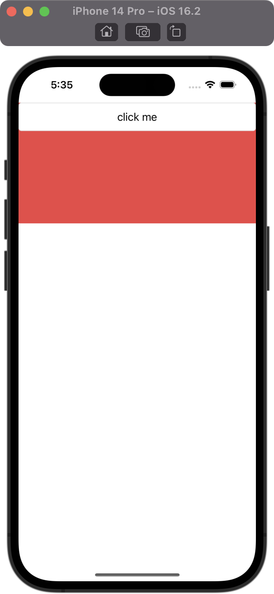

# MyAllEnd

Multi-Platform and full-stack, All in one




## usage
```
git clone

# for pc
npm install
npm run dev:pc

# for ios
npm install
npm run pod-install
npm run dev:ios
```

## catalog
package.json
- main [for electron]
- index.html [for electron]
- index.tsx [for rn]
- indexpc.tsx [for electron]

src
- mobile [react-native]
- pc [react-electron]
- common
## package
* i18n
* redux
* database
* file
* localstore
* request
* electron
