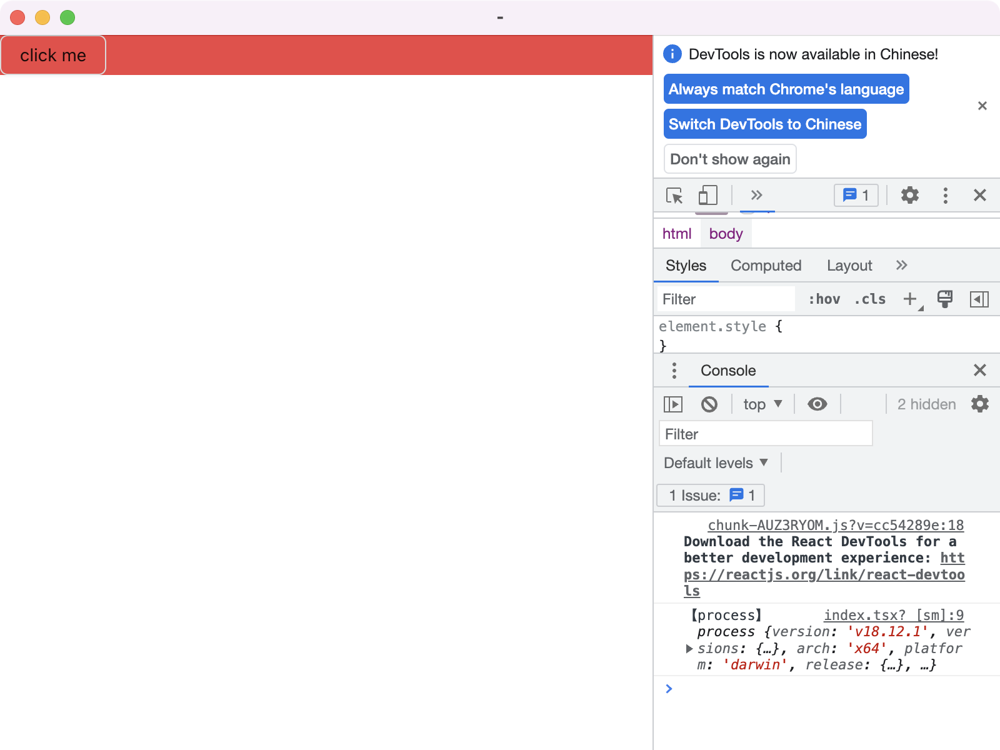

# MyAllEnd

Multi-Platform and full-stack, All in one




## usage
prepare your project name

prepare your production name
```
git clone https://github.com/HeroIsUseless/MyAllEnd.git
```
search 'myallend' in project and replace it by your project name

search 'MyAllEnd' in project and replace it by your production name
```
# for pc
npm install
npm run dev:pc

# for ios
npm install
npm run pod-install
npm run link-all
npm run build:ios
npm run dev:ios
```

## catalog
package.json
- main [for electron]
- index.html [for electron]
- index.tsx [for rn]
- indexpc.tsx [for electron]

src
- mobile [react-native]
- pc [react-electron]
- common
## package
* i18n
* redux
* database
* file
* localstore
* request
* electron

## what you should learn

* JavaScript
* HTML css
* TypeScript
* React
* Redux-Toolkit(RTK)
* Antd
* Electron
* React-Native
* NextJs
* NestJs
* MyApi*

more
* Sass
* Tailwind
* i18n
* Lottie
* Lodash 
* Mitt 

## help
如果有问题，或者有建议，请联系维护人：（微信）zhang-4696,备注 MyAllEnd
